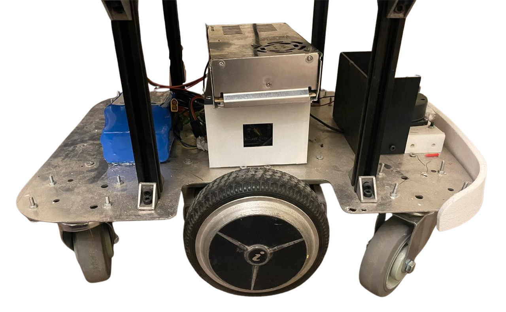
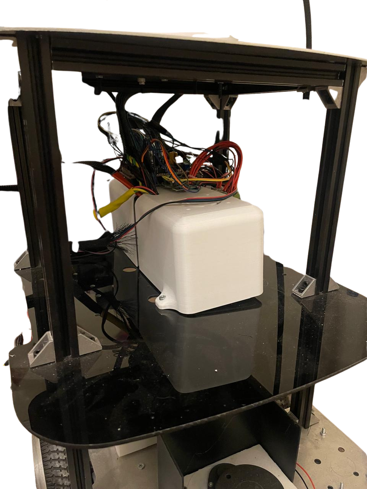
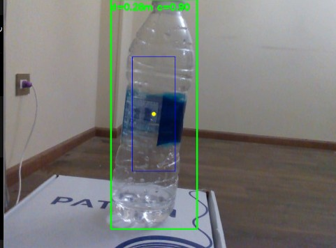
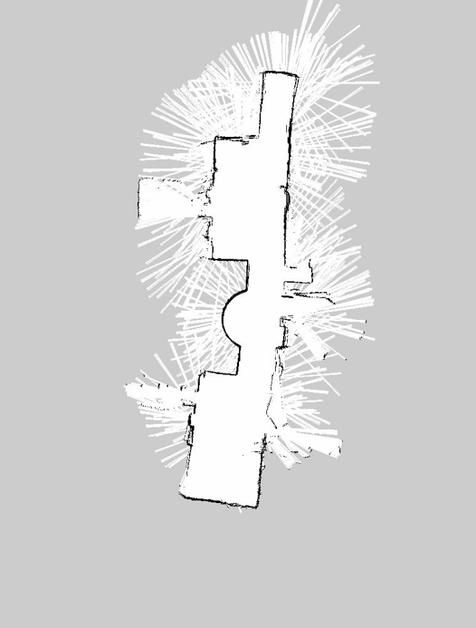
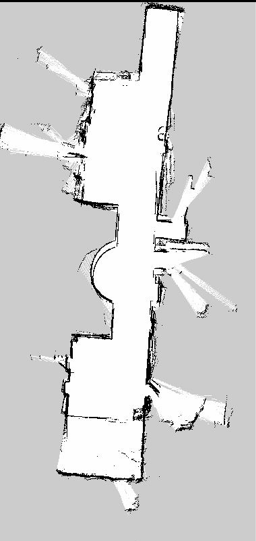
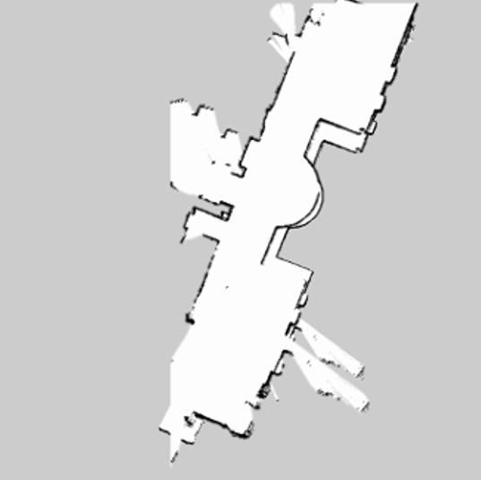

# Autonomous-MobileRobot-Manipulator
An Autonomous Mobile Manipulator Robot that can do navigation, motion planning, object detection and pick-and-place object, all of it driven with ROS noetic along with MoveIt.
## Overview
The Autonomous Mobile Manipulator Robot is a ROS noetic–based robotic system that combines autonomous mobile navigation with robotic manipulation to perform intelligent pick-and-place tasks. The platform is equipped with Navigation for autonomous navigation, MoveIt for motion planning, LiDAR and depth vision for perception and multi-sensor integration for robustness in dynamic scenarios. The robot is built using a modular and scalable structure, allowing it to move autonomously to designated target points, plan collision avoidance paths for its manipulator, and precisely grasp the objects and safely move them to the target points. This platform illustrates how navigation, perception, planning and manipulation can be integrated in industrial application.
## Design
The Autonomous Mobile Manipulator Robot is a modular robotic platform based on autonomous navigation, motion planning and intelligent manipulation of objects inside the indoor environment. It implements a fully autonomous pick and place operation using a mobile base based on differential drive and a robotic manipulator, while safely navigating through dynamic environments.
- Differential Drive Mobile Base: Provides stable and efficient locomotion for autonomous navigation, enabling the robot to move accurately through indoor environments and confined spaces.
- Robotic Manipulator: Multi-DOF robotic arm attached to mobile platform for accurate grasping and manipulation of objects using MoveIt motion planning.
- End-Effector (Gripper): A mechanism used to pick up, carry, and place an object with a high degree of accuracy.
- LiDAR Sensor: For SLAM, localization, obstacle detection, and autonomous navigation, providing real-time mapping of the environment.
- Depth Camera: Collects RGB-D data for picking and placing tasks, object detection and pose estimation, and visual feedback.
- The software back-bone or ROS Noetic Framework that allows communication between the navigation, perception, manipulation and control modules.
- MoveIt Motion Planning: Offers inverse kinematics, collision checking, trajectory generation and execution for smooth and collision free movements of manipulators.
<table align="center">
  <tr>
    <td align="center">
      
    </td>
    <td align="center">
      
  </tr>
</table>

Robot chassis

<table align="center">
  <tr>
    <td align="center">
      
    </td>
    <td align="center">
      
  </tr>
</table>

Robot cad model and prototype

## AI-Based Object Detection and Pick-and-Place

The robot integrates an AI-based object detection system trained using **YOLOv11** to identify and localize target objects within its operating environment. The trained model processes camera images in real time and provides bounding boxes and confidence scores for detected objects, enabling the robotic system to determine the target object's position.

The detection results are integrated with the robot's manipulation pipeline to support autonomous pick-and-place operations. Once the target object is detected, its location is used to determine the appropriate grasping position, after which **MoveIt** generates a collision-free trajectory for the robotic manipulator. The robot then approaches, grasps, transports, and places the detected object at the designated location.

The AI-based pick-and-place workflow includes the following key components:

* **YOLOv11 Object Detection:** A custom YOLOv11 model trained to recognize the target objects used in the robotic manipulation tasks.
* **Object Localization:** Bounding boxes and confidence scores are extracted from the detection results to determine the target object's location.
* **Camera-Based Perception:** Visual information from the depth camera is used to provide environmental and object information for the manipulation process.
* **Grasp Planning:** The detected object's position is used to determine a suitable grasping location for the robotic gripper.
* **MoveIt Motion Planning:** Generates collision-free trajectories for the manipulator and controls its movement toward the detected object.
* **Autonomous Pick-and-Place:** The robot combines perception, planning, and manipulation to detect, grasp, transport, and place objects autonomously.
  

  

## Localization and Mapping (SLAM)

The robot uses LiDAR-based Simultaneous Localization and Mapping (SLAM) to build a representation of the surrounding environment while estimating its position within the map. Several SLAM approaches were evaluated to determine the most suitable mapping solution for the robot, including **Gmapping, Karto SLAM, and Hector SLAM**.

The three algorithms were tested in the same indoor environment using the robot's LiDAR sensor. **Gmapping** uses a Rao-Blackwellized Particle Filter to integrate LiDAR measurements with wheel odometry, while **Karto SLAM** uses graph-based optimization for map generation. **Hector SLAM** relies primarily on LiDAR scan matching and does not require wheel odometry.

<table align="center">
  <tr>
    <td align="center">
       
      <b>Gmapping</b>
    </td>
    <td align="center">
       
      <b>Karto SLAM</b>
    </td>
    <td align="center">
       
      <b>Hector SLAM</b>
    </td>
  </tr>
</table>

  <b>Gmapping produced the most accurate and consistent occupancy grid, with fewer artifacts compared with Karto SLAM and Hector SLAM.</b>

### RTAB-Map 2D Mapping

**RTAB-Map (Real-Time Appearance-Based Mapping)** was also integrated and evaluated as an additional mapping and perception solution. It provides real-time mapping using sensor information and can be used to generate a 2D representation of the environment for navigation and localization.

The mapping process was tested by driving the robot through the environment while collecting sensor data. The resulting map demonstrates the robot's ability to incrementally build an environmental representation while moving through the workspace.

https://github.com/user-attachments/assets/3d76ba69-f4b9-4428-b307-44f6b029a566

  <b>RTAB-Map 2D Mapping Process</b>

## Navigation

The navigation system successfully integrates **mapping, localization, path planning, sensor data, and real-time obstacle avoidance** to enable autonomous mobile robot navigation. Using **ROS Noetic**, **RPLIDAR A1**, **AMCL**, and the **ROS Navigation Stack**, the robot can localize itself within the generated map, plan a suitable path toward a target, and safely navigate through the environment.

The combination of a **global planner** with the **DWA local planner** provides an effective balance between planned navigation and real-time obstacle avoidance. The system was successfully tested on the physical robot, demonstrating its ability to navigate toward a goal while detecting and avoiding a moving human obstacle.

The following videos demonstrate the navigation performance:

* **Dynamic_obstcle_avoidance:**
  
 https://github.com/user-attachments/assets/bd24097f-4398-4cf4-a7af-7b2e08f175fd</b>

  <b>The robot autonomously navigating while safely avoiding a person in its path</b>

* **Dynamic Obstacle Detection in rviz:**

https://github.com/user-attachments/assets/4f053155-f670-471c-8b7d-a166592a7b9a

These results confirm that the implemented navigation system provides reliable autonomous movement and reactive obstacle avoidance for the project's indoor environment.

## Robotic Arm Pick-and-Place

The robotic arm provides the mobile manipulator with the ability to physically interact with objects in the environment and perform autonomous **pick-and-place operations**. The manipulation system combines **object recognition, depth perception, inverse kinematics, motion planning, and gripper control** to determine the object's position and generate a safe trajectory for grasping.

The arm was first tested independently to verify the operation of the joint controllers and the calibration of the stepper motors. The arm was then commanded to predefined poses, including **Home, Carry, and Drop**, to confirm accurate and repeatable positioning. After the basic motion was validated, target points were commanded to the arm to verify that **TRAC-IK** could calculate suitable joint configurations and that **MoveIt with OMPL** could generate reachable and collision-free trajectories.

For the complete pick-and-place pipeline, the object is first **recognized by the vision system**. The **Intel RealSense D435i depth camera** provides the three-dimensional position of the detected object. This position is transformed into the coordinate frame of the robotic arm and used as the target grasp position. The arm then executes the complete manipulation sequence:

**Home → Reach → Close Gripper → Lift → Carry → Drop → Open Gripper → Home**

This allows the robot to autonomously detect an object, move the arm to the object's position, grasp it, lift it, transport it to the designated location, and release it. The complete system was successfully tested on the physical robot, demonstrating the integration of **object recognition, 3D perception, inverse kinematics, motion planning, and robotic grasping**.

### Pick-and-Place Demonstration

The following video demonstrates the complete pick operation, starting from **object recognition**, followed by arm positioning, grasping,and lifting.

** Pick After Object Recognition:** 

https://github.com/user-attachments/assets/cff93973-2504-4fcf-ae37-b40e61f5f265

